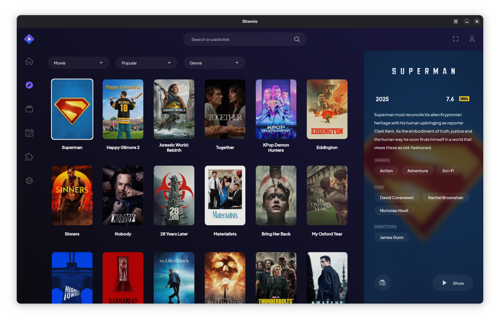

<div align="center">


# Stremio on Linux 
Client for Stremio on Linux using [`gtk4`](https://docs.gtk.org/gtk4/) + [`libadwaita`](https://gnome.pages.gitlab.gnome.org/libadwaita/doc/1.8/) + [`WebKitGTK`](https://webkitgtk.org/) + [`libmpv`](https://github.com/mpv-player/mpv/blob/master/DOCS/man/libmpv.rst)



</div>

## Installation

```bash
flatpak remote-add --if-not-exists flathub-beta https://flathub.org/beta-repo/flathub-beta.flatpakrepo
flatpak install flathub-beta com.stremio.Stremio
```

## Development

```bash
git clone --recurse-submodules https://github.com/Stremio/stremio-linux-shell
```

### Building

#### Fedora
```bash
dnf install gtk4-devel libadwaita-devel webkitgtk6.0-devel mpv-devel libepoxy-devel flatpak-builder
```

```bash
cargo build --release
```

#### Ubuntu
```bash
apt install build-essential pkg-config libgtk-4-dev libadwaita-1-dev libwebkitgtk-6.0-dev libmpv-dev gettext nodejs flatpak-builder
```

```bash
cargo build --release
```

#### Flatpak
```bash
flatpak install -y \
    org.gnome.Sdk//50 \
    org.gnome.Platform//50 \
    org.freedesktop.Sdk.Extension.rust-stable//25.08 \
    org.freedesktop.Platform.ffmpeg-full//24.08 \
    org.freedesktop.Platform.VAAPI.Intel//25.08
python3 -m pip install aiohttp tomlkit
```

```bash
./flatpak/build.sh
```